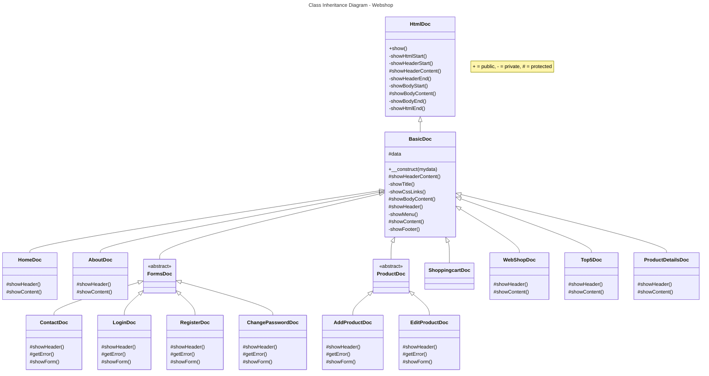

```mermaid
---
title: Class Inheritance Diagram - Webshop
---
classDiagram
    note "+ = public, - = private, # = protected"
    %% A <|-- B means that class B inherits from class A %%
    HtmlDoc <|-- BasicDoc

    BasicDoc <|-- HomeDoc
    BasicDoc <|-- AboutDoc
    BasicDoc <|-- FormsDoc
    BasicDoc <|-- ProductDoc
    BasicDoc <|-- ShoppingcartDoc
    BasicDoc <|-- WebShopDoc
    BasicDoc <|-- Top5Doc
    BasicDoc <|-- ProductDetailsDoc

    FormsDoc <|-- ContactDoc
    FormsDoc <|-- LoginDoc
    FormsDoc <|-- RegisterDoc
    FormsDoc <|-- ChangePasswordDoc

    ProductDoc <|-- AddProductDoc
    ProductDoc <|-- EditProductDoc

    class HtmlDoc{
       +show()
       -showHtmlStart()
       -showHeaderStart()
       #showHeaderContent()
       -showHeaderEnd()
       -showBodyStart()
       #showBodyContent()
       -showBodyEnd()
       -showHtmlEnd()
    }
    class BasicDoc{
        #data 
        +__construct(mydata)
        #showHeaderContent()
        -showTitle()
        -showCssLinks()
        #showBodyContent()
        #showHeader()
        -showMenu()
        #showContent()
        -showFooter()
    }
    class HomeDoc{
        #showHeader()
        #showContent()
    }
    class AboutDoc{
        #showHeader()
        #showContent()
    }
    class FormsDoc{
        <<abstract>>
    }
    class ProductDoc{
        <<abstract>>
    }
    class WebShopDoc{
        #showHeader()
        #showContent()
    }
    class Top5Doc{
        #showHeader()
        #showContent()
    }
    class ProductDetailsDoc{
        #showHeader()
        #showContent()
    }
    class ContactDoc{
        #showHeader()
        #getError()
        #showForm()
    }
    class LoginDoc{
        #showHeader()
        #getError()
        #showForm()
    }
    class RegisterDoc{
        #showHeader()
        #getError()
        #showForm()
    }
    class ChangePasswordDoc{
        #showHeader()
        #getError()
        #showForm()
    }
    class AddProductDoc{
        #showHeader()
        #getError()
        #showForm()
    }
    class EditProductDoc{
        #showHeader()
        #getError()
        #showForm()
    }
    

```
